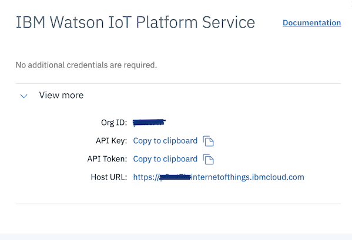

# Connection Configuration

The `connection.json` is a JSON file that allows you to define the connection related 
configuration item. The location of this file is `<InstallRoot>/ibm/masdc/volume/config/connection.json`. 
The conneection configuration items are specified in three json objects:
configuration file to specify configuration items:

```
{
    "ignition": {},
    "wiotp": {},
    "monitor": {},
    "deviceType": {},
    "alarmType": {},
}
```

- `ignition`: Configuration items used to connect to SCADA hostorian to extract device data
- `wiotp`: Configuration items used to connect to Watson IoT Platform Service
- `monitor`: Configuration items used to connect to Watson IoT Platform Data Lake to upload device data


## Configuration Object "ignition"

The `ignition` configuration object is required. The configuration items specified in this object is used
to connect to SCADA historian to extract data and create a **csv** file in **/mnt/volume/data/csv** directory.
The data from the **csv** is transformed and mappped in a format required to configure Watson IoT Platform
service and upload data in Watson IoT Plateform data lake.

To configure `ignition` object, details of configured database in SCADA historian are needed.

Specify the following configuration items in `ignition` configuration object:

- `dbtype`: Database server configured as SCADA hostorian. The valid values are sqlserver, and mysql.
- `host`: Database server host name.
- `port`: Database server listener port number.
- `database`: Database name.
- `schema`: Schema name.
- `user`: User name.
- `password`: Password
- `ssl`: Enable ssl. The valid options are true and false.


## Configuration Object "wiotp"

The `wiotp` configuration object is required. The configuration items are used to reegister device
type and devices in your Watson IoT Platform service, and create physical and logical interfaces,
based on device data extracted from SCADA historian, and device data tranformation and mapping configuration
specified for the entity type. For device data tranformation and mapping configuration, refer to 
[Entity Type Configuration](#data.md) section.

To configure `wiotp` object, yoou need WIoTP organiization id, API key and token. 
You can get these information using WIoTP dashboard:

Usage -> Watson IoT Platform Service -> View Details



Configuration items in `wiotp` configuration object:

- `orgId`: Specifies a six character organization Id assigned to your Watson IoT Platform service.
- `key`: Specifies API Key.
- `token`: Specifies API Token.
- `tenantid`: Specifies tenant id.
- `geo`: Specifies geographic code where MAS Monitor is subscribed.


## Configuration Object "monitor"

This configuration object is required. The configuration items specified in this object are uused to
connect to the configured data lake in WIoTP and upload device data. To configure `monitor` object, 
details of configured data lake in WIoTP are needed. You can get the data lake details using WIoTP dashboard. 

For example if data lake is Db2 Warehouse on Cloud, you can get details using:

Usage -> Db2 Warehouse on Cloud -> View Details


Specify the following configuration items in `monitor` configuration object:

- `dbtype`: Database server configured as Data Lake in Watson IoT Platform. The supported values are Db2Warehouse and PostGres.
- `host`: Database server host name.
- `port`: Database server listener port number.
- `schema`: Schema name.
- `user`: User name.
- `password`: Password


## Sample `connection.json` Configuration File

```
{
    "ignition": {
        "dbtype": "sqlserver",
        "host": "172.17.0.3",
        "port": "3306",
        "database": "msdb",
        "schema": "dbo",
        "user": "xxxxxx",
        "password": "xxxxxxxxxx",
        "ssl": "false"
    },
    "wiotp": {
        "orgId": "xxxxxx",
        "key": "a-xxxxxx-xxxxxxxxxx",
        "token" : "xxxxxxxxxxxx"
    },
    "monitor": {
        "dbtype": "Db2Warehouse",
        "host": "db2w-xxxxxxx.us-south.db2w.cloud.ibm.com",
        "port": "5001",
        "schema": "BLUADMIN",
        "user": "bluadmin",
        "password": "9_XXXXXXXXXXXXXXXXXXXX"
    }
}
```

