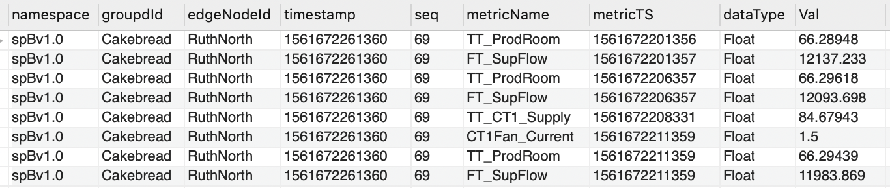

# Entity Type Configuration

In Watson IoT Platform Data Lake, the device data for different entity/device types are stored in 
their own table. The tables are named as `IOT_<entityType>`. The configuration items that 
controls data extraction for a specific entity type from SCADA historian, transform and map into
required format and upload to Watson IoT Platform Data Lake, are defined in a configuration file 
`<InstallRoot>/volume/config/<entityType>.json`.

The configuration items are provided to handle two use cases.

- Each record in SCADA historian table represents one event from a device.


- Each record in SCADA historian table represents all events from a device.

 
## Configuration Object

Provide data configuration object in a json formated file:
```
{
    "client": "string",
    "database": {
        "sqlStatement": "string",
        "fetchSize": integer,
        "insertSize": integer,
        "scanInterval": integer
    },
    "tagData": {
        "tagpath": "string",
        "tagpathParseCount": integer,
        "tagMap": {},
        "eventTagLevel": integer,
        "eventColumnName": "string"
    },
    "entityData": {
        "deviceType": "string",
        "deviceId": "string",
        "deviceIdPrefix": "string",
        "deviceIdFormat": "string",
        "registerDevice": true|false
    },
    "eventData": {
        "timestamp": "string",
        "id": "string",
        "type": "string",
        "value": "string",
        "consolidateTimestamp": true|false,
        "ignoreTypes": [],
        "registerInterfaces": true|false
    },
    "discardColumns": [],
    "renameColumns": [],
    "interfaceEvents": {},
    "interfaceRequired": [],
    "mqttEvents": integer
}
```

Where:

* `client`: Defines the name of the customer
* `database`: Specifies database related configuration items to extract and upload data
    * `sqlStatement`: Specifies custom SQL statement to extract entity data from SCADA historian
    * `fetchSize`: Specifies chunk size for data extraction
    * `insertSize`: Specifies batch insert size
    * `scanInterval`: Specifies interval in seconds to scan for new data in SCADA historian


** This page is still under construction **


