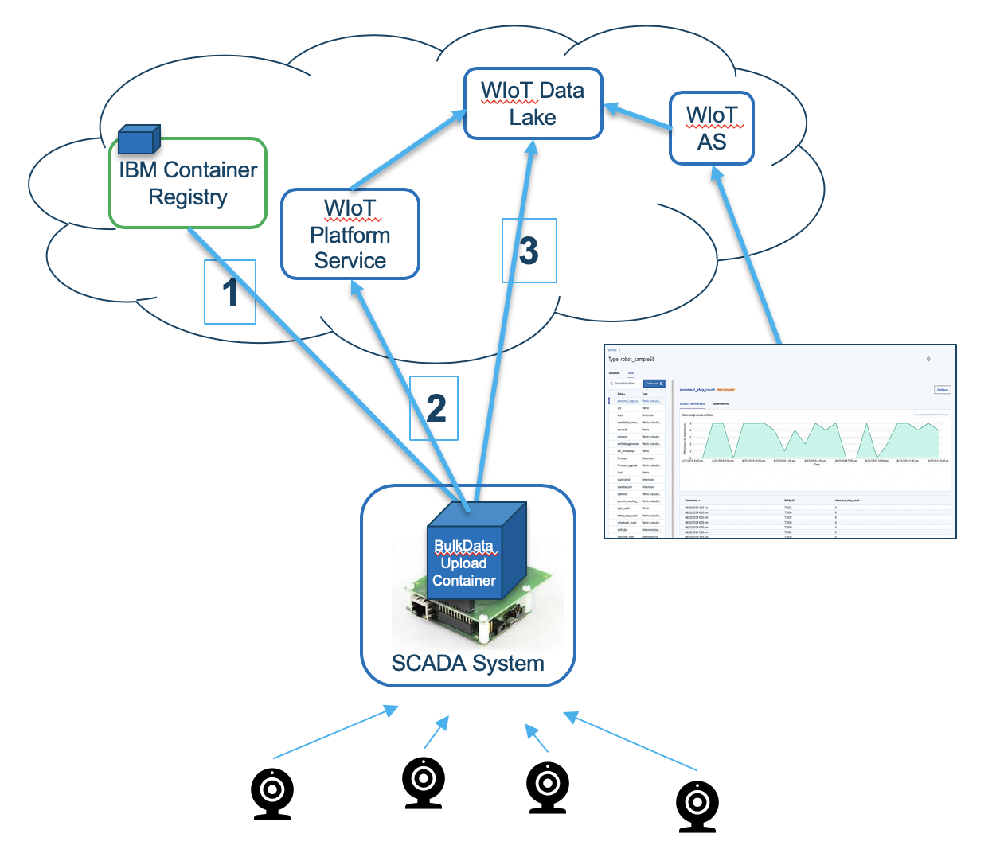

# Overview

IBM MAS Data Ingest connector lets you bulk upload historical device data from SCADA historian 
to Watson IoT Platform Data Lake. The uploaded data can be used by IBM
Watson IoT Platform Analytics Service for visualizatiion and AI-driven analytics. 

## Bulk Data Ingest High-Level Flow

1. Deploy connector on a host system, and configure to extract device data from SCADA historian.
2. Configure connector to register device types and devices, and configure Physical and Logical interfaces based on a sample data set extracted from SCADA historrian, and send a sample event for tables to get created for the device type in WIoTP data lake.
3. Bulk Data upload to Watson IoT Platform data lake.

